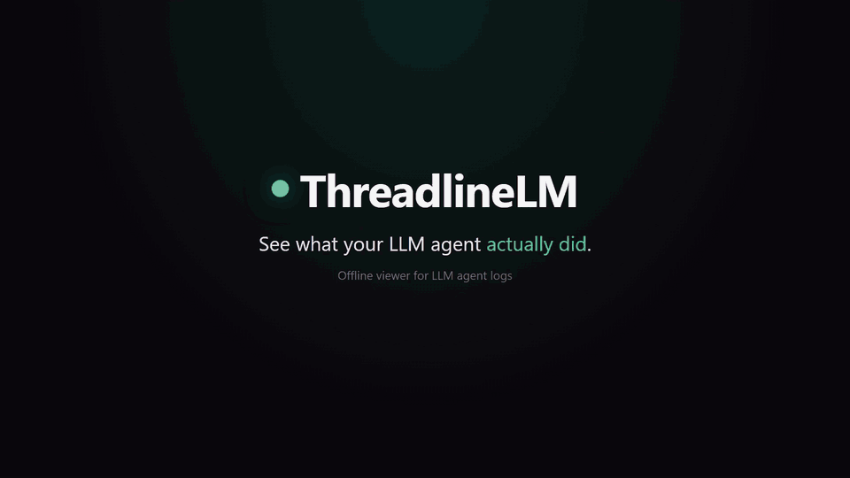
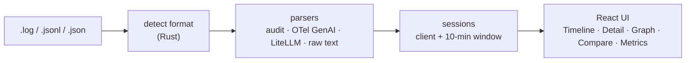

<div align="center">

# ThreadlineLM

**See what your LLM agent actually did: offline, from the logs you already have.**

[](https://github.com/aralde/ThreadlineLM/releases/latest)
[](https://github.com/aralde/ThreadlineLM/releases)
[](LICENSE)
[](https://tauri.app)
[](#download)
[](https://github.com/aralde/ThreadlineLM/stargazers)

[**Download**](#download) · [Features](#features) · [Supported formats](#supported-formats) · [Build from source](#build-from-source)

<a href="docs/media/demo.mp4"></a>

<sub>Click the animation for the full-resolution video.</sub>

</div>

When an agent run goes wrong, the evidence is in a log full of JSON: requests, responses, tool calls, streamed chunks, retries. ThreadlineLM is a desktop app that turns that file into a readable timeline, the reconstructed conversation per session, and a graph of every tool call. Drop the file on the window. Nothing leaves your machine.

Reads **OpenAI-compatible audit logs**, **OpenTelemetry GenAI spans** and **LiteLLM** logs. The format is detected from the contents, so the file extension doesn't matter.

If it saves you a debugging session, a ⭐ helps other people find it.

## Download

Grab the latest build from **[Releases](https://github.com/aralde/ThreadlineLM/releases/latest)**:

| Platform | File |
|---|---|
| Windows | `ThreadlineLM_<version>_x64-setup.exe` (installer), `.msi`, or `_x64-portable.exe` (no install) |
| macOS (Apple Silicon) | `ThreadlineLM_<version>_aarch64.dmg` |
| macOS (Intel) | `ThreadlineLM_<version>_x64.dmg` |
| Linux | `.AppImage`, `.deb` or `.rpm` |

Then drop any file from [`inputExample/`](inputExample) onto the window to see it in action.

> [!NOTE]
> The binaries are not code-signed yet. On Windows, SmartScreen may warn: choose **More info → Run anyway**. On macOS, run `xattr -dr com.apple.quarantine /Applications/ThreadlineLM.app` once after installing.

## Build from source

Prerequisites: Node 20+, pnpm 10+, a stable Rust toolchain (`rustup`), and the [Tauri system dependencies](https://tauri.app/start/prerequisites/) for your OS (WebView2 on Windows is usually preinstalled).

```bash
git clone https://github.com/aralde/ThreadlineLM
cd ThreadlineLM
pnpm install
pnpm tauri dev
```

Then drop `inputExample/audit.log` onto the window. You should see 9 calls in the Timeline, the reconstructed chat in Detail, a user / assistant / tool-call graph, and p50/p95 latency in Metrics.

## Features

- **Rebuild the conversation.** Calls are grouped into sessions and replayed as a chat, including tool calls, tool results and reasoning (chain-of-thought) content when the provider returns it.
- **Follow tool calls as a graph.** Every session becomes a flow graph of user, assistant and tool-call nodes, so loops and dead ends are visible at a glance.
- **Watch a run live.** Follow a log while the agent is still writing to it; the view reparses every time the file changes (polled every 500 ms).
- **Diff two calls.** Compare requests and responses side by side to see what changed between a working run and a broken one.
- **Know what it cost.** Latency percentiles (p50/p95/p99), token counts, estimated cost, and call counts by provider and model.
- **Private by design.** 100% local and in memory. No network calls, no telemetry, no account. Safe for logs with customer data or secrets.
- **Search and export.** Fuzzy search across calls; export a session to Markdown for a bug report or a postmortem.

Shortcuts: `Ctrl+1..5` switches between Timeline, Detail, Graph, Compare and Metrics.

## Supported formats

`inputExample/` holds one synthetic file per format, so every parser can be tried without real traces:

| Format | Example file | Events |
|---|---|---|
| OpenAI-compatible audit JSONL: tool calls, SSE stream, reasoning, Anthropic `tool_use`, a 429 error | `audit.log` | 9 |
| Same audit records as a JSON array | `audit-array.json` | 3 |
| OpenTelemetry GenAI spans, plain attributes, one per line (non-GenAI spans are skipped) | `otel-genai-spans.jsonl` | 3 |
| OTLP/JSON export envelope (`resourceSpans`) with KeyValue attributes | `otel-genai-otlp.json` | 2 |
| LiteLLM `StandardLoggingPayload`: streamed response, tool use, embedding, failure | `litellm.jsonl` | 5 |
| Plain-text proxy log with audit JSON embedded in some lines | `proxy-raw.log` | 2 |

Limitation: JSON must be one record per line (or a single-line OTLP envelope). Pretty-printed multi-line JSON is not detected yet.

## How it works



Parsing and session grouping run in the Rust backend; the React frontend gets typed results over Tauri IPC (the bridge between the Rust process and the web view). Stack: Tauri 2, React, TypeScript, Vite, Tailwind v4.

```
src/                       React + TS frontend
  components/              one view per tab (Timeline, Detail, Graph, Compare, Metrics)
  state/store.ts           Zustand store
  ipc.ts                   typed wrappers around invoke()
src-tauri/src/
  parser/                  format detection and one parser per format
  session.rs               grouping by client + 10-min window
  export.rs                session_to_markdown
  commands.rs              #[tauri::command] exposed to the frontend
inputExample/              one synthetic example per supported format
```

## Tests

```bash
cd src-tauri
cargo test
```

The `parses_input_example` and `example_*` tests parse every file in `inputExample/` and check format detection and event counts.

## Build

```bash
pnpm tauri build
```

Produces per-platform installers under `src-tauri/target/release/bundle/` (Windows MSI/NSIS, macOS DMG, Linux AppImage/deb).

| Command | Output |
|---|---|
| `pnpm tauri build` | `.exe` + NSIS installer + `.msi` |
| `pnpm tauri build --no-bundle` | portable `.exe` only (~10–15 MB, `src-tauri/target/release/threadlinelm.exe`) |
| `pnpm tauri build --bundles nsis` | NSIS installer only |

<details>
<summary><b>Fully portable Windows build (no system WebView2)</b></summary>

The `.exe` uses Microsoft Edge WebView2 as its rendering engine. It ships with Windows 11; on older Windows 10 builds it is downloaded on first launch if missing.

To avoid depending on the system WebView2 or the internet (≈ +150 MB), embed the Fixed Version Runtime. Download it from [aka.ms/webview2](https://developer.microsoft.com/microsoft-edge/webview2/) and add to `src-tauri/tauri.conf.json`:

```json
"bundle": {
  "windows": {
    "webviewInstallMode": {
      "type": "fixedRuntime",
      "path": "path/to/Microsoft.WebView2.FixedVersionRuntime.x.y.z.x64"
    }
  }
}
```

Ship the **entire folder**, not just the `.exe`, because WebView2 sits next to it.

</details>

<details>
<summary><b>Releases and cross-compiling</b></summary>

Cross-building between Windows, macOS and Linux from one host needs each target's native toolchain, so releases are built on CI. Pushing a `v*` tag triggers [`.github/workflows/release.yml`](.github/workflows/release.yml), which builds on `windows-latest`, `macos-latest` (Apple Silicon and Intel) and `ubuntu-22.04`, then attaches the installers and a portable Windows `.exe` to a draft GitHub Release for review before publishing.

```bash
git tag -a v0.3.0 -m "v0.3.0" && git push origin v0.3.0
```

</details>

## Status

Early: v0.3.0. Formats and views are stable enough for daily debugging; expect rough edges on unusual log shapes. If a log of yours isn't detected, an issue with a redacted sample is the most useful bug report.

## Contributing

Issues and PRs welcome at <https://github.com/aralde/ThreadlineLM/issues>. New format parsers are especially welcome: add a synthetic sample to `inputExample/` and a test next to the existing `example_*` tests.

## License

MIT. See [LICENSE](LICENSE).
